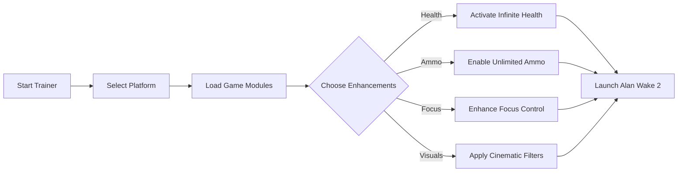

# ⚡ Alan Wake 2 Trainer

Step into the shadows with full control. The **Alan Wake 2 Trainer** is a professional-grade enhancement tool built for players who want to fine-tune performance, master combat flow, and reshape gameplay mechanics in real time. Whether you’re optimizing difficulty, experimenting with cinematic lighting, or unlocking creative effects — this trainer puts you in command of every variable.

---

## 🧠 Overview

The **Alan Wake 2 Trainer** merges stability, precision, and adaptability in one modern interface. Designed for both casual and hardcore players, it enhances everything from resource management to environmental clarity, ensuring smooth, responsive gameplay even during the most intense encounters.


> [!IMPORTANT]
> Use this Trainer responsibly — it’s meant for *single-player experience enhancement only*. Avoid use in connected or online sessions.

---

## 🔍 Key Features

* **Infinite Health & Focus** – Survive nightmarish encounters without losing momentum.
* **Unlimited Ammo** – Keep your flashlight and weapons ready through every dark corridor.
* **Enhanced Stamina Mode** – Extend sprint duration and boost recovery rates dynamically.
* **Cinematic Mode Toggle** – Apply real-time visual filters for photo-real scenes and filmic tones.
* **Enemy Slow Motion** – Activate temporal slowdown for precision aiming and cinematic control.
* **Inventory Boost Panel** – Instantly refill healing items, batteries, or manuscripts.
* **Performance Optimizer** – Adjust render distance, shadows, and frame limits from within the overlay.

---

## 🧩 Compatibility Matrix

| Platform                  | Status            | Integration                  |
| ------------------------- | ----------------- | ---------------------------- |
| **Windows 10/11**         | ✅ Fully Supported | Native DX12 build            |
| **Steam Edition**         | ✅ Automatic Sync  | Auto-detect path             |
| **Epic Games Store**      | ⚙️ Supported      | Manual path setup            |
| **NVIDIA RTX / AMD GPUs** | ✅ Optimized       | Supports ray tracing toggles |
| **Gamepad Users**         | ✅ Compatible      | Overlay navigable via D-pad  |

> [!NOTE]
> Ensure **HDR** and **Fullscreen Borderless** are enabled for the overlay to appear correctly when injecting.

---

## ⚙️ Quick Setup Guide

Here’s how to deploy the Trainer safely and efficiently:

```bash
# 1. Extract files
unzip alanwake2_trainer.zip

# 2. Run the launcher
AlanWake2Trainer.exe

# 3. Choose your platform
(Steam / Epic Games)

# 4. Enable modules
[Health] [Ammo] [Focus] [Performance]

# 5. Start the game directly from the trainer
```

**Hotkeys:**

* `F1` → Toggle Menu
* `F2` → Infinite Health
* `F3` → Max Ammo
* `F4` → Super Focus Mode
* `F8` → Slow Motion On/Off

---

## 🎬 Feature Flow Diagram



---

## ❓ FAQ

### 💡 Does the Trainer work with the latest Alan Wake 2 patches?

Yes — automatic version sync ensures compatibility. The launcher checks your build and adjusts offsets dynamically.

### ⚙️ Is it safe for my save files?

Absolutely. All variables are handled in-memory and revert after closing the game. No permanent data modification occurs.

### 🧠 Can I use multiple features together?

Yes, the modular architecture allows stacking any combination (e.g., Health + Slow Motion + Cinematic Mode).

### 🎮 Does it support controllers?

Yes, full navigation via D-pad and button bindings. Works natively with Xbox and DualSense controllers.

### 🧱 How do I uninstall it?

Simply delete the extracted folder. No registry entries or system traces are left behind.

---

## 🧰 Technical Highlights

* Lightweight injection (under 20 MB footprint)
* Auto-cleanup and safe exit handling
* Zero latency between toggle actions
* Optimized for DirectX 12 pipeline
* Compatible with overlay tools (ReShade, MSI Afterburner, etc.)

---

## 🪶 Visual Control Interface

The in-game overlay offers a clean, minimal dashboard:

```
──────────────────────────────
 ALAN WAKE 2 TRAINER
──────────────────────────────
[✔] Infinite Health
[✔] Infinite Ammo
[ ] Focus Boost
[ ] Visual Filters
[Apply Settings]
──────────────────────────────
```

Switch features with arrow keys or controller bumpers. The system auto-saves your layout for the next session.

---

## 🌌 Final Thoughts

The **Alan Wake 2 Trainer** transforms your horror-thriller journey into a customizable cinematic adventure. Perfect for players seeking balance between immersion and control, this tool delivers unmatched responsiveness, flexibility, and stability — letting you focus on the story rather than survival limits.

---
